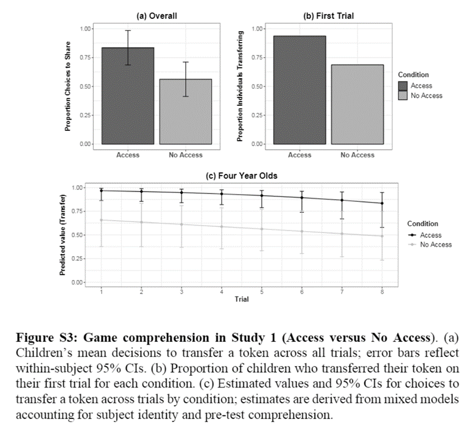
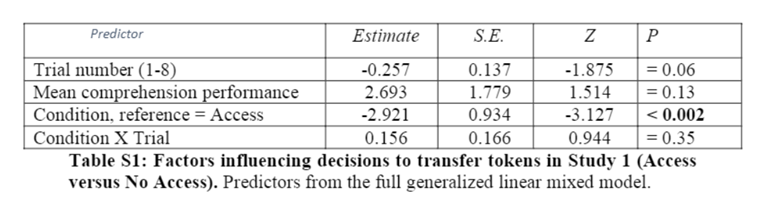

```{r setup, include=FALSE}
knitr::opts_chunk$set(echo = TRUE, warning = FALSE, comment = "##", prompt = TRUE, tidy = TRUE, tidy.opts = list(width.cutoff = 75), fig.path = "img/")
```

# Overview

In this analysis, I will replicate the analyses in Study 1 of Rosati et al. (2019), "Economic trust in young children."

The purpose of Study 1 was to test whether 4-year-olds, the youngest participants (age 4), could comprehend the rules of the economic game used to test economic trust in the later studies. Rosati et al. tested 1) average performance on comprehension tests, 2) average performance in two conditions, and 3) trial-by-trial performance accounting for repeated measures, condition, trial number, and comprehension check scores.

The analyses I replicate:
1) Performance on comprehension tests
  1a) Mean
  1b) Confidence interval
  1c) One sample, one-tailed t-test
2) Comparison of performance in two conditions of the game
  2a) Means
  2b) Confidence intervals
  2c) Two sample, one-tailed t-test
3) Figure replication
  3a) Replicate two barplots
  3b) Suggest a boxplot as an alternative
4) Trial-by-trial performance in two conditions of the game
  4a) GLMM Fitting
  4b) GlMM Comparison using likelihood ratio tests
# Preparation

Installing packages:

* Install: {tidyverse}, {distributions3}, {ggpubr}, {gridExtra}, {lme4}, {emmeans}, {effects}, {Rmisc}, {Matrix}

* Certain versions of {Matrix} and {lme4} have a compatibility issue. I had to manually delete both packages and reinstall, following the advice of Mikael Jagan at https://stackoverflow.com/questions/77481539/error-in-initializeptr-function-cholmod-factor-ldeta-not-provided-by-pack
```{r, eval=FALSE}
oo <- options(repos = "https://cran.r-project.org/")
install.packages("Matrix")
install.packages("lme4")
options(oo)
```

Load in packages.
```{r, warning=FALSE}
library(tidyverse) #for some of the data organizing
library(distributions3) #for StudentsT()
library(ggpubr) #for ggplot functions and ggarrange()
library(gridExtra) 
library(lme4) #for glmer()
library(Matrix) #for glmer()
```

Load in the original data as formatted by the authors.
```{r load in data}
study1 <- read.csv("https://raw.githubusercontent.com/Brothamer/baroth-data-replication-assignment/main/Rosati_etal_Trust_Study1.csv")
head(study1)
```

## 1) Comprehension Tests

Do 4-year-olds show above chance (50%) performance on comprehension questions?
Ho: Performance is not greater than 50%.
HA: Performance is greater than 50%.

Subsetting the data frame to have one entry per subject because each subject only has 1 score for comprehension proportion:
```{r}
study1_comprehension <- distinct( #Remove duplicate rows so that each subject has only 1 entry
                            subset(study1, select = -c(Trial_absolute, Trial_condition, Condition, Share))) #Remove columns not relevant to this specific analysis so that each subject has 16 identical entries
head(study1_comprehension)
```

### 1a) Mean 

Mean comprehension proportion correct:
```{r}
comprehension_mean <- mean(study1_comprehension$Comp_prop_correct)
comprehension_mean
```
Rosati et al. reported mean: 69.8%
My mean: 69.8125%

Mean was successfully replicated.

### 1b) Confidence Interval

Confidence interval of the mean:
```{r}
#upper = mean + (quantile method confidence level)(sample standard error)/(sqrt(n))
mean(study1_comprehension$Comp_prop_correct) +  quantile(StudentsT(df=15), 0.05 / 2) * sd(study1_comprehension$Comp_prop_correct) / sqrt(16)
#lower= mean - (quantile method confidence level)(sample standard error)/(sqrt(n))
mean(study1_comprehension$Comp_prop_correct) + quantile(StudentsT(df=15), 1 - 0.05 / 2) * sd(study1_comprehension$Comp_prop_correct) / sqrt(16)

#Or

t.test(study1_comprehension$Comp_prop_correct) #faster to use the t.test() function
#But it has to be a two-sided t-test!
```
Rosati et al reported 95% confidence interval: [55.2, 84.4%]
My 95% confidence interval: [55.23865, 88.438635%]

Confidence interval was successfully replicated.

### 1c) One-Sample, One-Tailed T-test

One sample, one-tailed T test of whether the mean percent correct is greater than chance (50%).
```{r}
t.test(study1_comprehension$Comp_prop_correct, 
       mu=0.5, #mean expected by chance
       alternative = "greater") #testing if the observed mean is greater than the null
```
Rosati et al reported values: t15 = 2.90, p < 0.05
My values: t15 = 2.8976, p = 0.005524

T-test results were successfully replicated.

Note: the confidence interval from this one-tailed t-test is not the reported confidence interval of the mean in general.

## 2) Response to task by condition

Are 4-year-olds more likely to share (opposed to not share) when they have access to the other side of the game (i.e. when they can receive what they shared)?
Ho: No difference in probability of sharing between Access and No Access conditions.
HA: Probability of sharing is greater in the Access condition than the No Access condition.

### 2a) Means

Aggregate data frame so there is one mean probability of sharing for each subject:
```{r}
#apply the function mean to the Share of each group of observations with the same condition and ID
study1_share <- aggregate(Share ~ ID + Condition, data=study1, FUN = mean)
head(study1_share)
```

Calculate the means of each condition:
```{r}
#apply the function mean to the Share of each group of observations with the same condition
condition_means <- aggregate(Share ~ Condition, data=study1_share, FUN = mean)
condition_means
```
Rosati et al. reported means: Access = 83.6%, No Access = 56.3%
My means: Access = 83.59375%, No Access = 56.25000%

Means were successfully replicated.

### 2b) Confidence intervals of the mean difference
```{r}
t.test(Share ~ Condition, 
       data = study1_share, 
       paired = TRUE, #the values in the first set each correspond to a value in the other set
       alternative = "two.sided") #must be two tailed to get the right confidence interval
```
Rosati et al reported 95% confidence interval: [6.2, 48.4%]
My 95% confidence interval: [6.24982, 48.43768%]

Confidence intervals were successfully replicated.

### 2c) Paired-Samples, One-Tailed T-test

```{r}
t.test(Share ~ Condition, 
       data = study1_share, 
       paired = TRUE, #the values in the first set each correspond to a value in the other set
       alternative = "greater") #testing if the observed mean difference is greater than 0
                        #specifically, mean of Access is greater than mean of No Access
```

Rosati et al reported values: t15 = 2.76, p < 0.05
My values: t15 = 2.763, p = 0.007251

Results of the t-test were successfully replicated.

## 3) Figure Replication


### 3a) Replicate two boxplots

Original figure:

#### (a) Overall plot

```{r}
Overall <- ggbarplot(study1_share, #data
                     x = "Condition", y = "Share", #x and y variables
 add = "mean_ci", #add the confidence interval error bar by calculating CI 
 fill = "Condition", palette = c("gray39", "gray"), #fill colors
          ylab = "Proportion Choices to Share", main = "(a) Overall", #labels
 ylim = c(0,1)) + #extend y-axis higher
  theme_bw() + #nice theme
  theme(plot.title = element_text(hjust=0.5), #center plot title
        legend.position="none", #remove legend (to be added back later)
        axis.title.x = element_blank()) #remove x-axis label
Overall
```

Problem: using multiple methods, I am getting different 95% confidence intervals for the means of each condition in figure S3(a). When I calculate the confidence intervals of the means outside of creating the figure (see below), I get confidence intervals that match my version of the figure: Access 95% CI = [0.670, 1.002], No Access = [0.374, 0.751.]. The figure in Rosati et al appears to have slightly narrower confidence intervals. The authors specified that the 95% confidence intervals are calculated within subject, so I know that is not the problem (though I also calculated the CIs for all trials independently just in case.)

Confidence intervals of Share means for each condition:
```{r}
study1_share_access <- study1_share[study1_share$Condition == "Access",] #Subset of the data with Access trials only
study1_share_noaccess <- study1_share[study1_share$Condition == "NoAccess",] #Subset of the data with NoAccess trials only
t.test(study1_share_access$Share) #one sample, two-tailed t-test to get confidence intervals
t.test(study1_share_noaccess$Share) #one sample, two-tailed t-test to get confidence intervals
```

#### (b) First Trial plot
Preparing dataframe for first-trial of each condition barplot:
```{r}
study1_firsttrial <- study1[study1$Trial_condition == 1, ] #Subset of the whole study data using only first trials in each condition
prop_share_firsttrial <- aggregate(Share ~ Condition, data=study1_firsttrial, FUN = mean) #calculate the mean of the first trials for each condition
prop_share_firsttrial
```

Plot:
```{r}

FirstTrial <- ggbarplot(prop_share_firsttrial, #use  the subsetted data with each subjects first trial in each condition
                        x = "Condition", y = "Share", #x and y variables
          fill = "Condition", palette = c("gray39", "gray"), #fill color
          ylab = "Proportion Individuals Transferring", ylim = c(0,1), main = "(b) First Trial") +
  theme_bw() + #nice theme
  theme(plot.title = element_text(hjust=0.5), #center the plot title
        legend.position="none", #remove legend (to be added back later)
        axis.title.x = element_blank()) #remove x-axis label
```

Arrange the plots with one legend for both of them.
```{r}
#Just the first plot again but with the legend included in order to extract the legend
Overall_withLegend <- ggbarplot(study1_share, x = "Condition", y = "Share",
 add = "mean_ci", lab.vjust = -1.6, fill = "Condition", 
          palette = c("gray39", "gray"),
          ylab = "Proportion Choices to Share", main = "(a) Overall", ylim = c(0,1)) +
  theme_bw() +
  theme(plot.title = element_text(hjust=0.5), axis.title.x = element_blank())

#a function to extract the legend from a plot (code from https://www.sthda.com/english/wiki/wiki.php?id_contents=7930#grid.arrange-create-and-arrange-multiple-plots)
get_legend<-function(myggplot){
  tmp <- ggplot_gtable(ggplot_build(myggplot))
  leg <- which(sapply(tmp$grobs, function(x) x$name) == "guide-box")
  legend <- tmp$grobs[[leg]]
  return(legend)
}

#save the legend from the first plot using the function
legend <- get_legend(Overall_withLegend)

#an arrangement of the two plots and one legend for the two of them
barplots <- ggarrange(Overall, FirstTrial, legend, ncol = 3, widths=c(2.3, 2.3, 0.8))
barplots
```

Rosati et al. published figure for comparison:


### 3b) Suggest a boxplot as an alternative figure

## 4) Trial by Trial GLMMs

Rosati et al used GLMMs fit as "binomial models with a logit link function using maximum likelihood."

### 4a) Model Fitting

The base model included random subject intercepts (ID), individual’s average performance on comprehension check questions (Comp_prop_correct), and trial number within condition (Trial_condition). They did not report the parameters of this model, though I suspect that I failed to exactly replicate their method. For a later model, the authors did report the parameters, and while my results are close, they do not match.
My attempt:
```{r}
basemod = glmer(data = study1, #glmer() function in {lme4} for GLMMs; specify data
                formula = Share ~ #binary response variable
                  Trial_condition + Comp_prop_correct + #fixed effect predictor variables
                  (1 | ID), #random intercepts grouped by subject (ID)
                family = binomial(link = "probit")) #specifies link function for a binomial model

summary(basemod)
```

Rosati et al's second model added Condition as a main predictor variable. Surprisingly, they did not report the specific parameters of this model despite this one being the best fit.
My attempt:
```{r}
conditionmod = glmer(data = study1, 
                     formula = Share ~ Trial_condition + Comp_prop_correct + 
                       Condition + #additional response variable
                       (1 | ID), 
                     family = binomial(link = "probit"))

summary(conditionmod)
```

Rosati et al. also tested a third model adding Condition by Trial interaction as an additional main predictor variable. The authors reported the parameters from this model in their supplementary material. My results follow a similar pattern but do not match exactly, suggesting that I have made an error in how I have set up these models. I suspect that any error would be in the formatting of the formula.
My attempt:
```{r}
fullmod = glmer(data = study1, 
                formula = Share ~ Trial_condition + Comp_prop_correct + Condition + 
                  Condition*Trial_condition + #additional response variable with interaction
                  (1 | ID), 
                family = binomial(link = "probit"))

summary(fullmod)
```
Rosati et al. published table:



### 4b) Model Comparison

Rosati et al compared the models fits using likelihood ratio tests.

Comparing the condition-only model to the base model show a significantly improved fit.
My attempt:
```{r}
LRT1<-anova(basemod, conditionmod) #likelihood ratio test using anova() to compare two models
LRT1
```
Rosati et al reported values: χ2 = 34.54, df = 1, p < 0.0001
My values: χ2 = 33.697, df = 1, p = 6.442e-09

Comparing the full model (with Condition and ConditionxTrial) to the condition-only model did not signficantly improve the fit.
My attempt:
```{r}
LRT2<-anova(conditionmod, fullmod) #likelihood ratio test using anova() to compare two models
LRT2
```
Rosati et al reported values: χ2 = 0.88, df = 1, p = 0.34, n.s.
My values: χ2 = 0.9538, df = 1, p = 0.3288, n.s.

The results of my test were similar to Rosati et al's, but because my chi square value is different, I suspect that the outcomes of my models did not match the reported models in the first place. While this is most likely an error on my part, Rosati et al could have improved the ease of replication of there analyses by including the formulas of the models they tested and the outcomes of each model as they did for their third model in the supplementary materials.