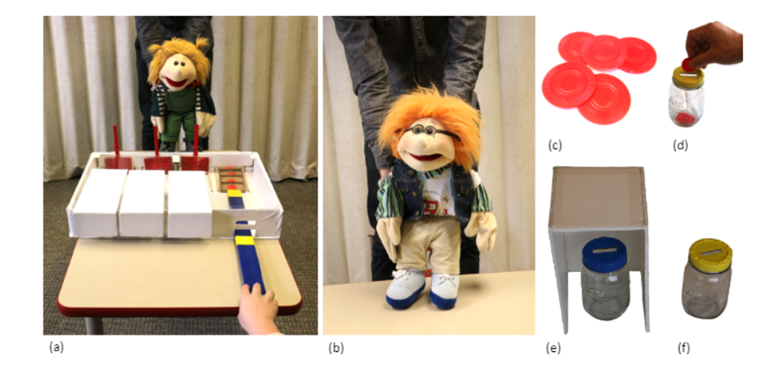

```{r setup, include=FALSE}
knitr::opts_chunk$set(echo = TRUE, warning = FALSE, comment = "##", prompt = TRUE, tidy = TRUE, tidy.opts = list(width.cutoff = 75), fig.path = "img/")
```



# Overview

I replicated the analyses in Study 1 of Rosati et al. (2019), "Economic trust in young children."

The general purpose of studies 1-3 was to understand how cooperative trust develops in children using an economic trust game. Overall, the studies demonstrated that children as young as 4 years share more when it is possible for others to reciprocate, and 6-year-olds are better than 4-year-olds at preferring to share with trustworthy partners.

The purpose of Study 1, specifically, was to test whether the youngest participants (age 4) could comprehend the rules of the games used to test economic trust in the later studies. Rosati et al. tested 1) average performance on comprehension tests, 2) average performance in two conditions, and 3) trial-by-trial performance accounting for repeated measures, condition, trial number, and comprehension check scores.

The analyses I replicated:

1. Comprehension test performance
    + Mean
    + Shapiro-Wilkes test for normal distribution
    + Confidence interval
    + One sample, one-tailed t-test
2. Comparison of two experimental conditions (Access/No Access)
   + Means
   + Confidence intervals
   + Two sample, one-tailed t-test
3. Figure replication
   + Replicate two barplots
4. Trial-by-trial performance in two conditions of the game
   + GLMM Fitting
   + GLMM Comparison using likelihood ratio tests

**All the required components of this assignment are met within sections 1) and 3). For ease of grading, only those two sections are necessary to read. I included the other analyses because I wanted to see one study all the way through and try GLMMs.**  
  
# Preparation

Installing packages:

* Install: {tidyverse}, {nortest}, {twosamples}, {distributions3}, {ggpubr}, {lme4}, {Matrix}

* Certain versions of {Matrix} and {lme4} have a compatibility issue. I had to manually delete both packages and reinstall, following the advice of Mikael Jagan at https://stackoverflow.com/questions/77481539/error-in-initializeptr-function-cholmod-factor-ldeta-not-provided-by-pack
```{r, eval=FALSE}
oo <- options(repos = "https://cran.r-project.org/")
install.packages("Matrix")
install.packages("lme4")
options(oo)
```

Load in packages.
```{r, warning=FALSE}
library(tidyverse) #for data organizing
library(nortest) #for ad.test
library(twosamples) #for ad_test()
library(distributions3) #for StudentsT()
library(ggpubr) #for ggbarplot(), ggboxplot(), and ggarrange()
library(lme4) #for glmer()
library(Matrix) #for glmer()
```

Load in the original data as formatted by the authors.
```{r load in data}
study1 <- read.csv("https://raw.githubusercontent.com/Brothamer/baroth-data-replication-assignment/main/Rosati_etal_Trust_Study1.csv")
head(study1)
```

This data includes results for n=16 four-year-old participants (ID). The independent variable being tested is a binary measure of whether children did or did not share/transfer tokens in a trust game (Share). Each participant was tested in 16 trials (Trial_absolute: 1-16). Half of these trials were in a condition where children had access to the "other side" of the game (Condition = Access), meaning they could receive the materials they successfully transferred. For the other half of the trials, the children could not access the other side of the game (Condition = NoAccess). The data include a variable for the trial number within each condition (Trial_condition). The children also completed 6 comprehension checks during the trials. The data includes the average score of those six comprehension checks (Comp_prop_correct) which is the same value for every trial that child participated in.

# Analyses

## 1) Comprehension Tests

Do 4-year-olds show above chance (50%) performance on comprehension questions?
* H0: Performance is not greater than 50%.
* HA: Performance is greater than 50%.

Subsetting the data frame to have one entry per subject because each subject only has 1 score for comprehension proportion:
```{r}
study1_comprehension <- distinct( #Remove duplicate rows so that each subject has only 1 entry
                            subset(study1, select = -c(Trial_absolute, Trial_condition, Condition, Share))) #Remove columns not relevant to this specific analysis so that each subject has 16 identical entries
head(study1_comprehension)
```

### 1a) Mean 

Mean comprehension proportion correct:
```{r}
comprehension_mean <- mean(study1_comprehension$Comp_prop_correct) #take a mean
comprehension_mean
```
Rosati et al. reported mean: 69.8%
My mean: 69.8125%

Mean was successfully replicated.

### 1b) Anderson-Darling for Normal Distribution

In the data, n < 30, so it is appropriate to check if the data is normally distributed. Assumedly, Rosati et al. would also have checked for normality before conducting their analyses.

I used an Anderson-Darling Test for normality because it can accept a small sample size of n=16. A Shapiro-Wilk test would have greater power but may be too sensitive for testing the assumptions of a t-test (referring to the module presented by Erin Anderson, Lillian Holden, Amanda Wu, and Emily Yang).

* H0: the sample follows a normal distribution
* HA: the sample does not follow a normal distribution

```{r}
ad.test(study1_comprehension$Comp_prop_correct)
```
The p-value is not significant at greater than 0.05. Therefore this test fails to reject the null hypothesis that the data is normally distributed. Therefore, we can continue with tests that assume no significant variation from a normal distribution.

### 1c) Confidence Interval

Confidence interval of the mean:
```{r}
#upper = mean + (quantile of Student's T distribution)(sample standard error)/(sqrt(n))
mean(study1_comprehension$Comp_prop_correct) +  quantile(StudentsT(df=15), 0.05 / 2) * sd(study1_comprehension$Comp_prop_correct) / sqrt(16)
#lower= mean - (uantile of Student's T distribution)(sample standard error)/(sqrt(n))
mean(study1_comprehension$Comp_prop_correct) + quantile(StudentsT(df=15), 1 - 0.05 / 2) * sd(study1_comprehension$Comp_prop_correct) / sqrt(16)

#Or

t.test(study1_comprehension$Comp_prop_correct) #faster to use the t.test() function
#But it has to be a two-sided t-test!
```
Rosati et al reported 95% confidence interval: [55.2, 84.4%]
My 95% confidence interval: [55.23865, 88.438635%]

Confidence interval was successfully replicated.

### 1d) One-Sample, One-Tailed T-test

One sample, one-tailed T test of whether the mean percent correct is greater than chance (50%).
```{r}
t.test(study1_comprehension$Comp_prop_correct, 
       mu=0.5, #mean expected by chance
       alternative = "greater") #testing if the observed mean is greater than the null
```
Rosati et al reported values: t15 = 2.90, p < 0.05
My values: t15 = 2.8976, p = 0.005524

T-test results were successfully replicated.

Note: the confidence interval from this one-tailed t-test is not the reported confidence interval of the mean in general.

## 2) Response to task by condition

Are 4-year-olds more likely to share (opposed to not share) when they have access to the other side of the game (i.e. when they can receive what they shared)?
Ho: No difference in probability of sharing between Access and No Access conditions.
HA: Probability of sharing is greater in the Access condition than the No Access condition.

### 2a) Means

Aggregate data frame so there is one mean probability of sharing for each subject:
```{r}
#apply the function mean to the Share of each group of observations with the same condition and ID
study1_share <- aggregate(Share ~ ID + Condition, data=study1, FUN = mean)
head(study1_share)
```

Calculate the means of each condition:
```{r}
#apply the function mean to the Share of each group of observations with the same condition
condition_means <- aggregate(Share ~ Condition, data=study1_share, FUN = mean)
condition_means
```
Rosati et al. reported means: Access = 83.6%, No Access = 56.3%
My means: Access = 83.59375%, No Access = 56.25000%

Means were successfully replicated.

### 2b) Confidence intervals of the mean difference
```{r}
t.test(Share ~ Condition, 
       data = study1_share, 
       paired = TRUE, #the values in the first set each correspond to a value in the other set
       alternative = "two.sided") #must be two tailed to get the right confidence interval
```
Rosati et al reported 95% confidence interval: [6.2, 48.4%]
My 95% confidence interval: [6.24982, 48.43768%]

Confidence intervals were successfully replicated.

### 2c) Paired-Samples, One-Tailed T-test

```{r}
t.test(Share ~ Condition, 
       data = study1_share, 
       paired = TRUE, #the values in the first set each correspond to a value in the other set
       alternative = "greater") #testing if the observed mean difference is greater than 0
                        #specifically, mean of Access is greater than mean of No Access
```

Rosati et al reported values: t15 = 2.76, p < 0.05
My values: t15 = 2.763, p = 0.007251

Results of the t-test were successfully replicated.

## 3) Figure Replication

### 3a) Replicate two boxplots

The figure I am replicating actually appears in the supplementary materials, not the main publication. This is because I want to replicate a figure relevant to the rest of the analyses I replicated, and no figures from Study 1 are included in the main publication.

Original figure:

#### (a) Overall plot

```{r}
Overall <- ggbarplot(study1_share, #data
                     x = "Condition", y = "Share", #x and y variables
 add = "mean_ci", #add the confidence interval error bar by calculating CI 
 fill = "Condition", palette = c("gray39", "gray"), #fill colors
          ylab = "Proportion Choices to Share", main = "(a) Overall", #labels
 ylim = c(0,1)) + #extend y-axis higher
  theme_bw() + #nice theme
  theme(plot.title = element_text(hjust=0.5), #center plot title
        legend.position="none", #remove legend (to be added back later)
        axis.title.x = element_blank()) #remove x-axis label
Overall
```

Problem: using multiple methods, I am getting different 95% confidence intervals for the means of each condition in figure S3(a). When I calculate the confidence intervals of the means outside of creating the figure (see below), I get confidence intervals that match my version of the figure: Access 95% CI = [0.670, 1.002], No Access = [0.374, 0.751.]. The figure in Rosati et al appears to have slightly narrower confidence intervals. The authors specified that the 95% confidence intervals are calculated within subject, so I know that is not the problem (though I also calculated the CIs for all trials independently just in case.)

Confidence intervals of Share means for each condition:
```{r}
study1_share_access <- study1_share[study1_share$Condition == "Access",] #Subset of the data with Access trials only
study1_share_noaccess <- study1_share[study1_share$Condition == "NoAccess",] #Subset of the data with NoAccess trials only
t.test(study1_share_access$Share) #one sample, two-tailed t-test to get confidence intervals
t.test(study1_share_noaccess$Share) #one sample, two-tailed t-test to get confidence intervals
```

#### (b) First Trial plot
Preparing dataframe for first-trial of each condition barplot:
```{r}
study1_firsttrial <- study1[study1$Trial_condition == 1, ] #Subset of the whole study data using only first trials in each condition
prop_share_firsttrial <- aggregate(Share ~ Condition, data=study1_firsttrial, FUN = mean) #calculate the mean of the first trials for each condition
prop_share_firsttrial
```

Plot:
```{r}

FirstTrial <- ggbarplot(prop_share_firsttrial, #use  the subsetted data with each subjects first trial in each condition
                        x = "Condition", y = "Share", #x and y variables
          fill = "Condition", palette = c("gray39", "gray"), #fill color
          ylab = "Proportion Individuals Transferring", ylim = c(0,1), main = "(b) First Trial") +
  theme_bw() + #nice theme
  theme(plot.title = element_text(hjust=0.5), #center the plot title
        legend.position="none", #remove legend (to be added back later)
        axis.title.x = element_blank()) #remove x-axis label
FirstTrial
```

Arrange the plots with one legend for both of them.
```{r}
#Just the first plot again but with the legend included in order to extract the legend
Overall_withLegend <- ggbarplot(study1_share, x = "Condition", y = "Share",
 add = "mean_ci", lab.vjust = -1.6, fill = "Condition", 
          palette = c("gray39", "gray"),
          ylab = "Proportion Choices to Share", main = "(a) Overall", ylim = c(0,1)) +
  theme_bw() +
  theme(plot.title = element_text(hjust=0.5), axis.title.x = element_blank())

#a function to extract the legend from a plot (code from https://www.sthda.com/english/wiki/wiki.php?id_contents=7930#grid.arrange-create-and-arrange-multiple-plots)
get_legend<-function(myggplot){
  tmp <- ggplot_gtable(ggplot_build(myggplot))
  leg <- which(sapply(tmp$grobs, function(x) x$name) == "guide-box")
  legend <- tmp$grobs[[leg]]
  return(legend)
}

#save the legend from the first plot using the function
legend <- get_legend(Overall_withLegend)

#an arrangement of the two plots and one legend for the two of them
barplots <- ggarrange(Overall, FirstTrial, legend, ncol = 3, widths=c(2.3, 2.3, 0.8))
barplots
```

Rosati et al. published figure for comparison:


## 4) Trial by Trial GLMMs

Rosati et al used GLMMs fit as "binomial models with a logit link function using maximum likelihood." They also specified that they used the {lme4} package in R, so I can be confident that I am at least using the same function, glmer().

### 4a) Model Fitting

The base model included random subject intercepts (ID), individual’s average performance on comprehension check questions (Comp_prop_correct), and trial number within condition (Trial_condition). They did not report the parameters of this model, though I suspect that I failed to exactly replicate their method. For a later model, the authors did report the parameters, and while my results are very close, they do not match exactly.
My attempt:
```{r}
basemod = glmer(data = study1, #glmer() function in {lme4} for GLMMs; specify data
                formula = Share ~ #binary response variable
                  Trial_condition + Comp_prop_correct + #fixed effect predictor variables
                  (1 | ID), #random intercepts grouped by subject (ID)
                family = binomial(link = "logit")) #specifies link function for a binomial model

summary(basemod)
```

Rosati et al's second model added Condition as a main predictor variable. Surprisingly, they did not report the specific parameters of this model despite this one being the best fit.
My attempt:
```{r}
conditionmod = glmer(data = study1, 
                     formula = Share ~ Trial_condition + Comp_prop_correct + 
                       Condition + #additional response variable
                       (1 | ID), 
                     family = binomial(link = "logit"))

summary(conditionmod)
```

Rosati et al. also tested a third model adding Condition by Trial interaction as an additional main predictor variable. The authors reported the parameters from this model in their supplementary material.
My attempt:
```{r}
fullmod = glmer(data = study1, 
                formula = Share ~ Trial_condition + Comp_prop_correct + Condition + 
                  Condition*Trial_condition + #additional response variable with interaction
                  (1 | ID), 
                family = binomial(link = "logit"), nAGQ = 1)

summary(fullmod)
```
Rosati et al. published table:


Again, I did not exactly replicate their analyses, but it does appear that I came very close. Therefore, I suspect that my models differ from theirs in some setting. For example, I assumed that Rosati et al left the nAGQ argument set to 1 for a Laplace approximation. However, the authors did not specify the exact model, so it is possible that that assumption was incorrect.

### 4b) Model Comparison

Rosati et al compared the models fits using likelihood ratio tests.

Comparing the condition-only model to the base model show a significantly improved fit.
My attempt:
```{r}
LRT1<-anova(basemod, conditionmod) #likelihood ratio test using anova() to compare two models
LRT1
```
Rosati et al reported values: χ2 = 34.54, df = 1, p < 0.0001
My values: χ2 = 34.538, df = 1, p = 4.18e-09

The authors found that comparing the full model (including fixed effects of Condition and Condition x Trial) to the condition-only model did not signficantly improve the fit.
My attempt:
```{r}
LRT2<-anova(conditionmod, fullmod) #likelihood ratio test using anova() to compare two models
LRT2
```
Rosati et al reported values: χ2 = 0.88, df = 1, p = 0.34, n.s.
My values: χ2 = 0.8753, df = 1, p = 0.3495, n.s.

Despite having some differences in the third model, the results of my tests were similar to Rosati et al's. They would appear exact except the p-value in my second comparison is slightly higher, hinting that the models were not a match to begin with. While this is most likely an error on my part, Rosati et al could have improved the ease of replication of their analyses by including the formulas and specifications of the models they tested and the outcomes of each model as they did for their third model in the supplementary materials.